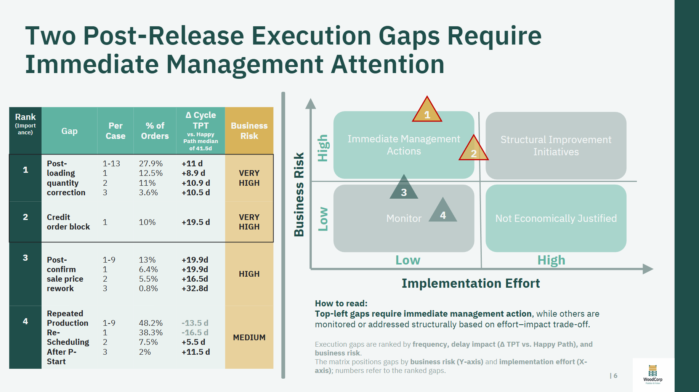
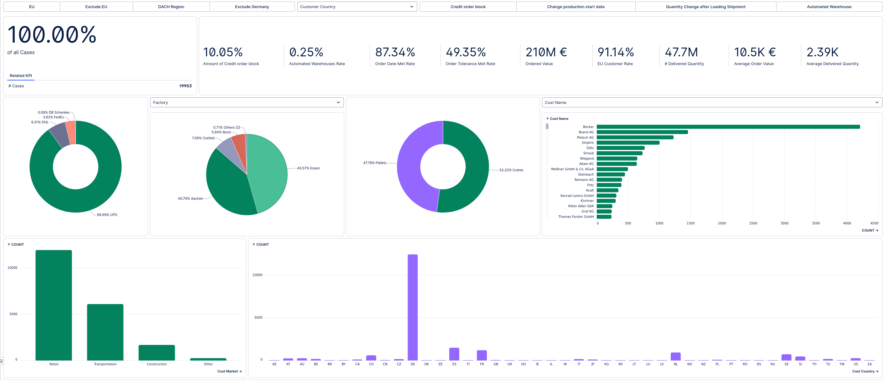
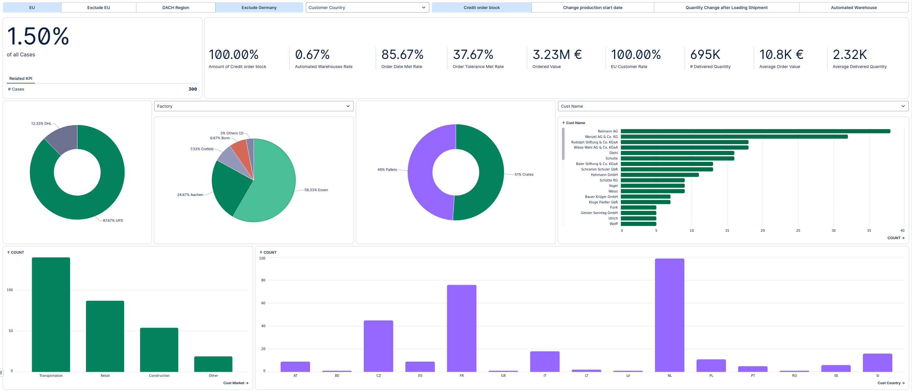
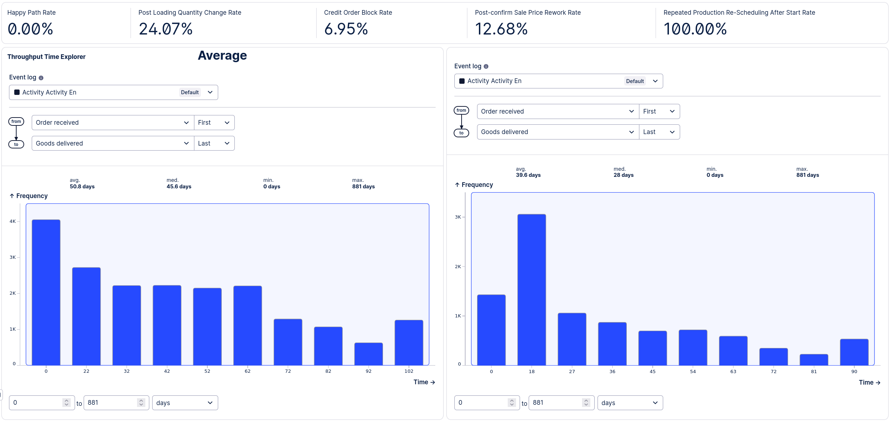
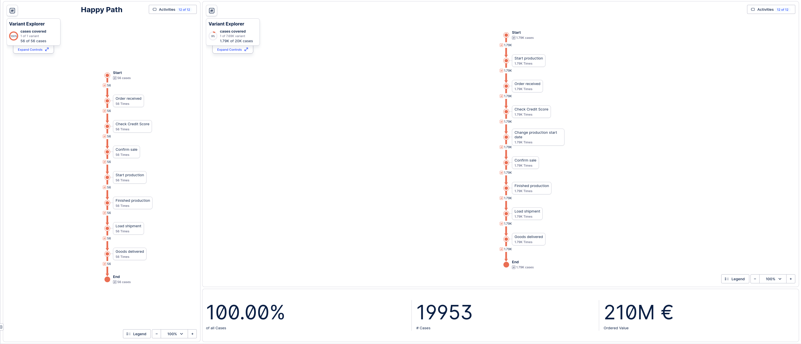
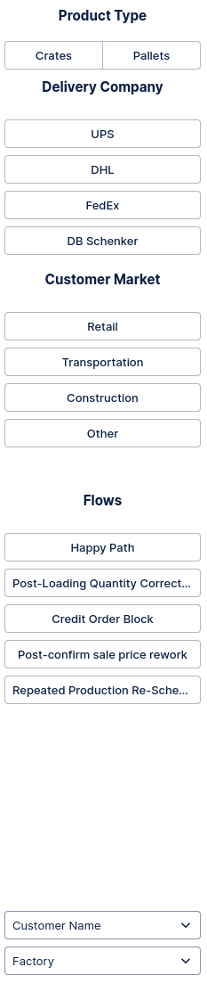

# Woodcorp Order-to-Cash (O2C) Process Analysis  
**BI-Reporting · Prozessanalyse · Entscheidungsunterstützung**

**Fokus:** Order-to-Cash · KPI-Logik · Execution Analysis  
**Tools:** Celonis · Python (Pandas)  
**Projektart:** Showcase-Projekt (synthetische Daten)

---

## Kurzfassung

- Analyse eines Order-to-Cash-Prozesses mit Fokus auf operative Abweichungen nach Order Release  
- Ziel: Identifikation von Ursachen für Verzögerungen und Instabilität in der Ausführung  
- Ergebnis: strukturierte Priorisierung von Execution Gaps nach Impact und Relevanz  
- Mehrwert: Ableitung konkreter, umsetzbarer Maßnahmen für operative Steuerung

[Zur Präsentation](results/presentation/Jan_Krings_O2C_Process_Analysis.pdf)

---

## Business Context

Nach der Auftragsfreigabe kommt es im Order-to-Cash-Prozess häufig zu Änderungen (z. B. Mengen, Produktionsplanung, Kreditstatus), die:

- Durchlaufzeiten verlängern  
- Planung destabilisieren  
- operative Effizienz reduzieren  

Diese Abweichungen sind oft nicht transparent und werden nicht systematisch bewertet.

**Zentrale Fragestellung:**  
Welche Abweichungen treten nach Order Release auf, und welche davon haben einen relevanten operativen und wirtschaftlichen Impact?

---

## Analytischer Ansatz

Die Analyse folgt einem strukturierten, impact-orientierten Vorgehen:

**Identify → Quantify → Analyze → Prioritize**

- Definition eines Referenzprozesses (Happy Path)  
- Identifikation von Abweichungen („Execution Gaps“)  
- Quantifizierung nach:
  - zusätzlicher Durchlaufzeit  
  - Häufigkeit  
  - Wert-Exposure  
- Priorisierung nach operativer Relevanz statt reiner Frequenz  

---

## Zentrale Ergebnisse

- Abweichungen nach Order Release erhöhen die mediane Durchlaufzeit um ca. **4 Tage**  
- Wenige wiederkehrende Muster verursachen den Großteil der Verzögerungen  
- Produktionsumplanungen betreffen ~50 % der Aufträge → Hinweis auf systemische Instabilität  
- Kreditblockierungen (~10 %) führen zu signifikanten Verzögerungen  
- Späte Mengenänderungen sind selten, aber mit hohem Impact verbunden  

**Kernerkenntnis:**  
Nicht die Häufigkeit, sondern der kombinierte Effekt aus Verzögerung, Wert und Wiederholbarkeit bestimmt die Relevanz von Problemen.

---

## Business Impact

Die Analyse ermöglicht:

- gezielte Identifikation von **hochrelevanten Execution Gaps**  
- Trennung von **systemischen Problemen vs. Einzelfällen**  
- Priorisierung von Maßnahmen nach tatsächlichem Impact  
- Vermeidung von breit gestreuten, ineffizienten Optimierungsmaßnahmen  

Typische Anwendung:

- Fokus auf wenige, wirkungsstarke Problemfelder  
- datenbasierte Steuerung operativer Verbesserungsmaßnahmen  
- Unterstützung von Prozessverantwortlichen bei Priorisierungsentscheidungen  

---

## Key Execution Gaps & Prioritization



---

## Analytische Umsetzung

- Analyse und Strukturierung von O2C-Prozessdaten  
- Definition und Berechnung zentraler KPIs (z. B. Durchlaufzeit, Delay)  
- Identifikation und Klassifikation von Execution Gaps  
- Quantifizierung von Impact (Zeit, Häufigkeit, Wert)  
- Entwicklung einer priorisierungsfähigen Bewertungslogik  
- Aufbereitung der Ergebnisse in Dashboards und Management-Präsentationen  

---

## Daten & Verarbeitung

- ~20.000 synthetische O2C-Fälle  
- Datenbasis:
  - `data/Woodcorp O2C Activity table.csv`
  - `data/Woodcorp O2C Case table.csv`  
- Analyse in Celonis (Prozesssicht, KPI-Logik, Filterung)  
- Ergänzende Verarbeitung und Validierung mit Python (Pandas)  

Weitere Details:
- [Data Description](analysis/docs/data-description.md)
- [Methodology](analysis/docs/methodology.md)
- [Assumptions](analysis/docs/assumptions.md)

---

## KPI-Logik (Beispiele)

- **Durchlaufzeit:** Zeit von Order Release bis Lieferung  
- **Delay:** Abweichung vom erwarteten Prozessablauf  
- **Execution Gap:** Abweichung vom Referenzprozess nach Order Release  
- **Impact:** Kombination aus Häufigkeit, zusätzlicher Zeit und Wert  

---

## Root Cause Analysis

Vertiefende Analysen:

- Segmentierung nach Ländern, Kunden und Produkttypen  
- Identifikation systematischer Muster statt Einzelfälle  
- Abgrenzung von zufälligen vs. strukturellen Problemen  

---

## Dashboard Preview







---

## Repository-Struktur

```text
analysis/                # Methodik, Annahmen, Root-Cause-Analysen
data/                    # synthetische O2C-Daten
results/dashboard/       # Dashboard-Screenshots
presentation/            # Management-Präsentation
README.md
```

## Transparenz

Die verwendeten Daten sind **synthetisch generiert**, bilden jedoch ein realistisches O2C-Szenario ab.  
Alle Analysen sind nachvollziehbar strukturiert und dokumentiert.

---

## Fazit

Das Projekt zeigt, wie Prozessdaten systematisch analysiert und in **priorisierte, umsetzbare Handlungsfelder** übersetzt werden können.

**Zentrale Stärke:**

- Fokus auf relevante Abweichungen statt vollständiger Prozessbeschreibung  
- Kombination aus Datenanalyse, KPI-Logik und Entscheidungsorientierung  

---

## Kontakt

📧 jankrings.data@gmail.com  
🔗 LinkedIn: https://de.linkedin.com/in/jan-krings-3bb081323  
💻 GitHub: https://github.com/jan-krings-dev  
